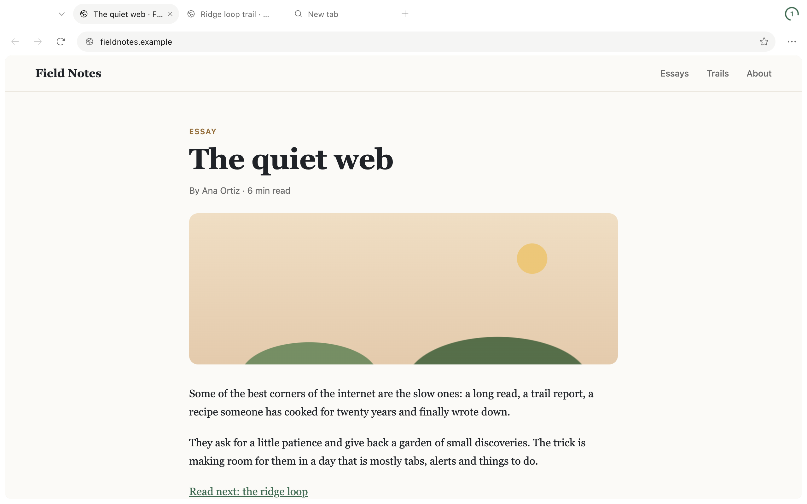
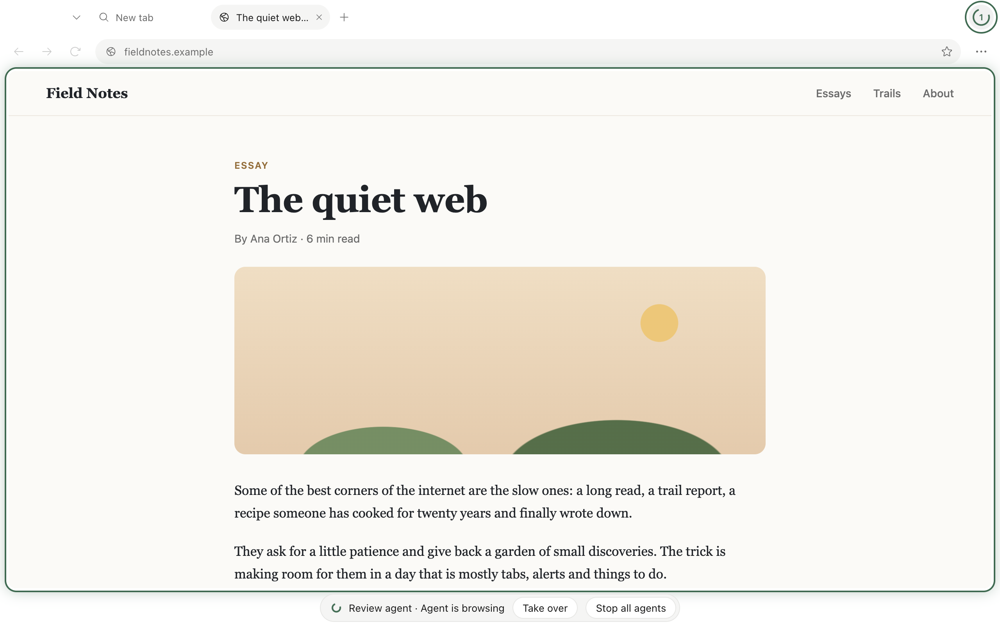
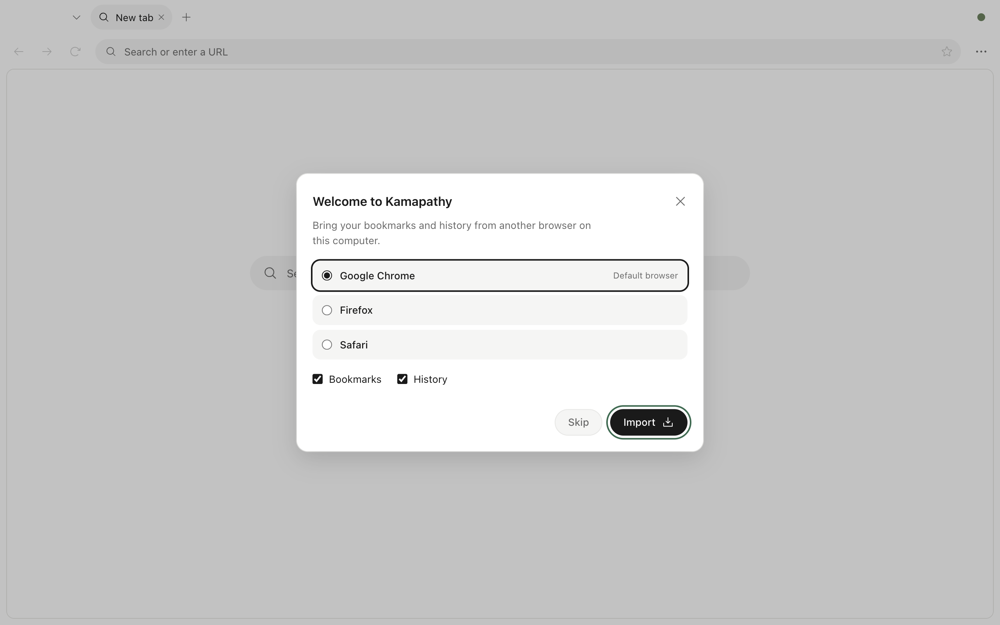
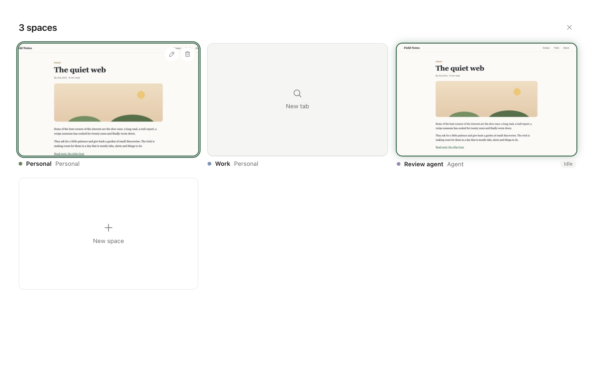
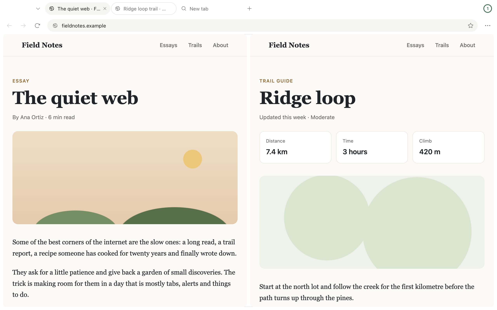
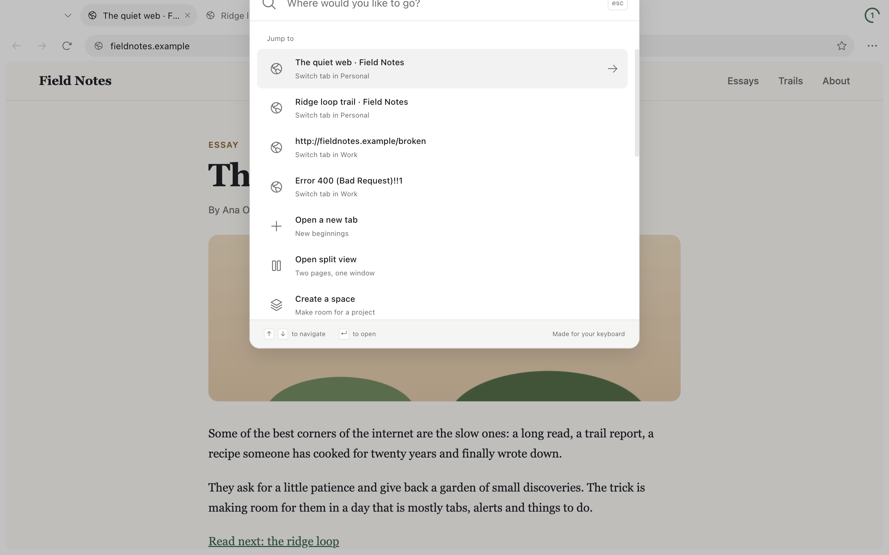
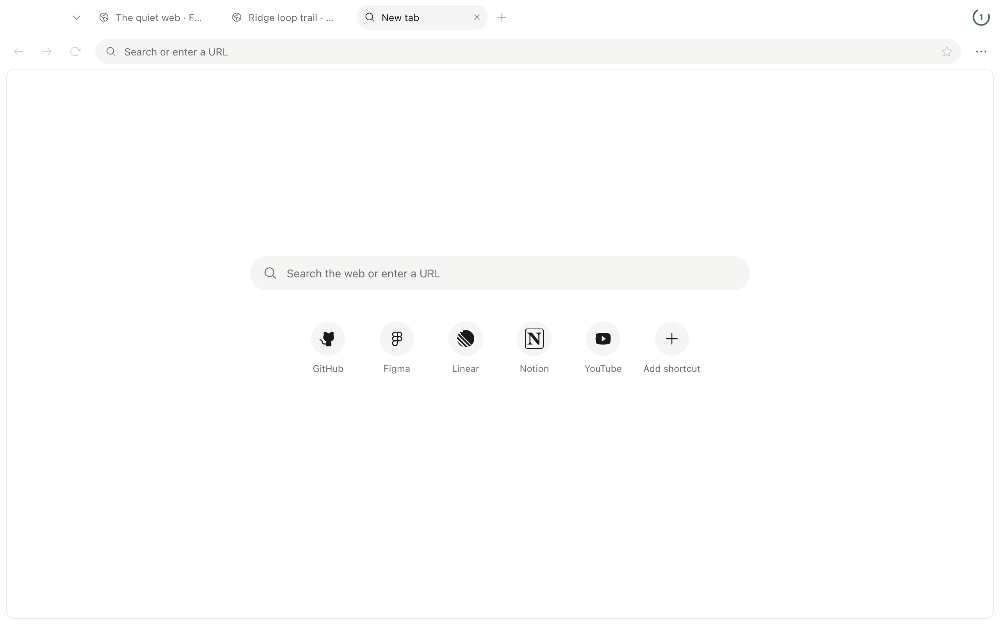
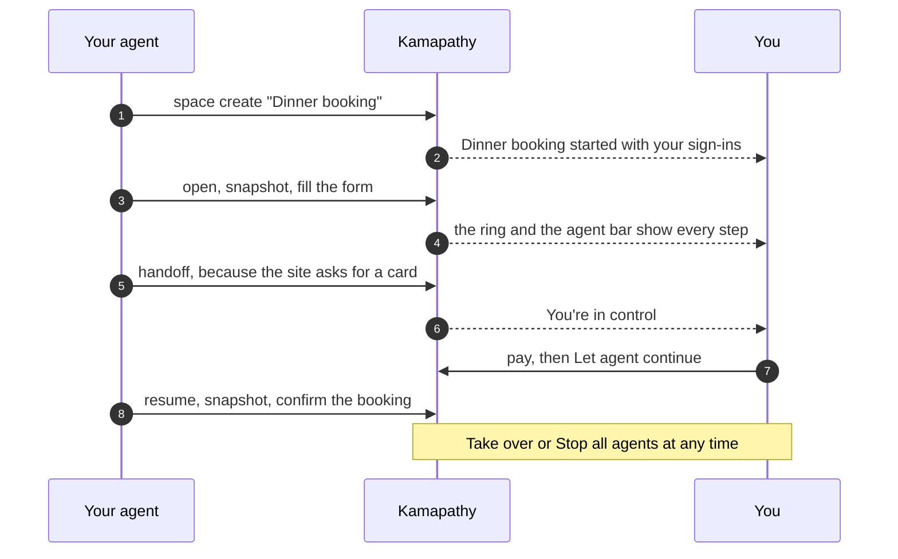

<p align="center">
  <a href="https://kamapathy.app"></a>
</p>

<h1 align="center">Kamapathy</h1>

<p align="center"><strong>A calm browser you share with your agents.</strong></p>

<p align="center">
  Sign in once. Let an agent work in a space of its own, with your sign-ins, where you can see it.<br />
  Take over with one click, and hand it back when you're ready.
</p>

<p align="center">
  <a href="https://kamapathy.app"><strong>Download</strong></a>
  &nbsp;·&nbsp;
  <a href="https://kamapathy.app/#demo"><strong>Try the live demo</strong></a>
  &nbsp;·&nbsp;
  <a href="docs/automation.md">Agent guide</a>
  &nbsp;·&nbsp;
  <a href="https://github.com/shayanmohd/kamapathy/issues">Feedback</a>
</p>

<p align="center">
  <a href="https://github.com/shayanmohd/kamapathy/actions/workflows/build.yml"></a>
  <a href="https://github.com/shayanmohd/kamapathy/releases"></a>
  <a href="LICENSE"></a>
  
</p>

<p align="center">Works with Claude Code, Codex, Cursor and any agent that can run a command.</p>

<picture>
  <source media="(prefers-color-scheme: dark)" srcset="docs/images/kamapathy-dark.png" />
  
</picture>

<p align="center"><sub>Screenshots follow your GitHub theme. Switch between light and dark to see both.</sub></p>

## Why Kamapathy

Browsers were built for one person at a keyboard. Coding and research agents now want to browse too, and the sites they need are the ones you are already signed in to. Kamapathy lets you sign in once. Every space and every agent can use that session, so an agent books the table, files the ticket or reads the dashboard as you, in a space of its own, in plain sight, while you keep browsing next to it. When you would rather it didn't, give that one space separate sign-ins, isolate every agent space with a switch, or turn off agent access and stop everything at once.

It is also simply a good browser: Chromium underneath, a small interface on top, and nothing that competes with the page.

<table>
  <tr>
    <td width="33%" valign="top">
      <h3>Spaces</h3>
      Personal spaces for work, home and side projects, agent spaces for whatever you hand off. One shortcut lays every space out side by side.
    </td>
    <td width="33%" valign="top">
      <h3>Agents in plain sight</h3>
      A green ring and a small bar show when an agent is working. <b>Take over</b> pauses it, <b>Let agent continue</b> hands it back.
    </td>
    <td width="33%" valign="top">
      <h3>Your sign-ins, on purpose</h3>
      Sign in once and every space and agent can use it. Give any space <b>Separate sign-ins</b>, or isolate every agent space from Settings.
    </td>
  </tr>
  <tr>
    <td width="33%" valign="top">
      <h3>Bring your browser with you</h3>
      On first launch, import bookmarks and history from Chrome, Chromium, Edge, Brave, Arc, Vivaldi, Opera, Firefox or Safari. Later, from Settings.
    </td>
    <td width="33%" valign="top">
      <h3>Sees the whole page</h3>
      Snapshots read open shadow roots and same-origin frames, nested ones too, and list cross-origin frames so an agent knows they are there.
    </td>
    <td width="33%" valign="top">
      <h3>Quiet by design</h3>
      Tabs across the top, one address bar, one menu. No account, no feed, no telemetry. Light and dark themes with a single accent.
    </td>
  </tr>
</table>

## Take the tour

Each section opens to a screenshot. Want to click around instead? The [live demo](https://kamapathy.app/#demo) runs a working copy of the interface in your browser, agent included.

<details open>
<summary><strong>An agent at work</strong>: a ring around its page and a bar to stop it</summary>
<br />
<picture>
  <source media="(prefers-color-scheme: dark)" srcset="docs/images/kamapathy-agents-dark.png" />
  
</picture>
</details>

<details>
<summary><strong>First launch: import and sign in once</strong>: bring your bookmarks and history, then open your top sites</summary>
<br />
<picture>
  <source media="(prefers-color-scheme: dark)" srcset="docs/images/kamapathy-welcome-dark.png" />
  
</picture>
</details>

<details>
<summary><strong>All your spaces at once</strong>: Option+S on macOS, Alt+S elsewhere</summary>
<br />
<picture>
  <source media="(prefers-color-scheme: dark)" srcset="docs/images/kamapathy-spaces-dark.png" />
  
</picture>
</details>

<details>
<summary><strong>Split view</strong>: two live pages in one window</summary>
<br />
<picture>
  <source media="(prefers-color-scheme: dark)" srcset="docs/images/kamapathy-split-dark.png" />
  
</picture>
</details>

<details>
<summary><strong>The command menu</strong>: jump to any tab or action from the keyboard</summary>
<br />
<picture>
  <source media="(prefers-color-scheme: dark)" srcset="docs/images/kamapathy-command-dark.png" />
  
</picture>
</details>

<details>
<summary><strong>A quiet new tab</strong>: a search box and your shortcuts</summary>
<br />
<picture>
  <source media="(prefers-color-scheme: dark)" srcset="docs/images/kamapathy-newtab-dark.png" />
  
</picture>
</details>

## How it compares

Two kinds of tools already let software browse. Kamapathy is neither: it is your own browser, and the agent is whichever one you already use.

| | Kamapathy | Automation libraries <sup>1</sup> | AI browsers with a built in assistant <sup>2</sup> |
| --- | :---: | :---: | :---: |
| Your own daily browser | ✓ | No | ✓ |
| Any agent you already use | ✓ | ✓ | No |
| Several agents at once, each in its own space | ✓ | Some | Some |
| Uses your sign-ins, with a switch to isolate | ✓ | Some | Some |
| Take over and hand back at any time | ✓ | No | Some |
| Sees shadow roots and same-origin frames | ✓ | ✓ | Some |
| Free and open source | ✓ | Some | Some |
| macOS, Windows and Linux | ✓ | ✓ | Some |
| No account, no telemetry | ✓ | Some | No |

<sup>1</sup> Browser automation libraries you drive from code, such as Playwright based tools: they launch a browser of their own, usually headless, and an agent uses them by writing a program rather than by using yours.<br />
<sup>2</sup> Browsers that ship with an assistant of their own: the assistant is part of the product, so it comes with that vendor's model, account and terms.<br />
Some means it depends on the product. Every row in the Kamapathy column describes what ships today.

## Get Kamapathy

Download the latest build from **[kamapathy.app](https://kamapathy.app)**, which picks the right file for your computer, or from [GitHub Releases](https://github.com/shayanmohd/kamapathy/releases).

| Your computer | Download |
| --- | --- |
| Mac with Apple silicon or Intel | DMG or ZIP |
| Windows 10 or 11, x64 | Installer or portable EXE |
| Linux, x64 | AppImage or Debian package |

Every release also carries the agent skill as a ZIP and a `SHA256SUMS.txt` file for checking downloads.

<details>
<summary><strong>Opening it the first time</strong>: this preview isn't signed with a paid certificate yet</summary>
<br />

**macOS.** Drag Kamapathy into Applications and open it. When macOS says it can't verify the app, click **Done**, then open **System Settings > Privacy & Security** and click **Open Anyway**. You only do this once.

**Windows.** If SmartScreen says it protected your PC, click **More info**, then **Run anyway**.

**Linux.** Make the AppImage executable with `chmod +x Kamapathy-*.AppImage` and run it, or install the Debian package with `sudo apt install ./Kamapathy-*.deb`.

</details>

On first launch Kamapathy offers to bring over your bookmarks and history from another browser on this computer, then shows your top sites so you can sign in once. Both are optional, and the import is always there later under **Settings > Browsing**.

## Bring your own agent

Kamapathy doesn't ship an AI model. It is the browser your agent uses, through a small Node.js client and a ready-made skill for Claude Code, Codex, Cursor and anything else that can run a command.



Install the skill in whichever way suits you:

```sh
npx skills add shayanmohd/kamapathy
```

Or download `Kamapathy-skill-<version>.zip` from the [latest release](https://github.com/shayanmohd/kamapathy/releases/latest) and unzip it into your agent's skills folder, such as `~/.claude/skills` or `~/.codex/skills`. Or install it from a source checkout:

```sh
npm ci
npm run skill:install                                          # Codex
npm run skill:install -- --destination ~/.claude/skills/kamapathy   # Claude Code
```

Then ask your agent to use Kamapathy. It connects on its own, with no token to copy, and starts Kamapathy if it isn't running. For a task with many steps, the agent writes one script instead of one command per step:

```js
// book.mjs
const dinner = await createSpace("Dinner booking");
const page = await dinner.open("https://table.example/reserve");
const view = await page.snapshot();
const ref = (label) =>
  view.interactables.find((control) => control.label === label).ref;
await page.batch([
  { type: "fill", ref: ref("Name"), value: "Avery Quinn" },
  { type: "fill", ref: ref("Party size"), value: "2" },
  { type: "click", ref: ref("Reserve") },
  { type: "wait", text: "Reserved", timeoutMs: 8000 },
]);
console.log(await page.text());
```

```sh
node kamapathy.mjs run book.mjs
```

The script runs on your computer with `createSpace`, `space` and `spaces` as globals. A space has `open`, `tabs`, `handoff`, `resume` and `close`; a page has `snapshot`, `text`, `click`, `fill`, `press`, `scroll`, `drag`, `wait`, `batch`, `upload`, `screenshot` and `navigate`. Each call sends one documented request over the local socket, so no JavaScript from the script ever reaches a web page. The same work, one command at a time:

```console
$ node kamapathy.mjs space create "Dinner booking"
space 8c1f2e04 "Dinner booking" agent shared
$ node kamapathy.mjs open 8c1f2e04 https://table.example/reserve
tab 51a9d7c3 https://table.example/reserve
$ node kamapathy.mjs snapshot 51a9d7c3
Reserve a table
https://table.example/reserve

Controls:
@e1 textbox "Name"
@e2 combobox "Party size"
@e3 button "Reserve"
```

<details>
<summary><strong>What agents can and can't do</strong></summary>
<br />

- Agents reach only the spaces they create, or ones you hand them. Your own tabs stay out of reach.
- Agent spaces use your sign-ins unless you isolate them. **Isolate agent spaces** in Settings > Agents gives every new agent space a temporary session of its own, and an agent can ask for one isolated space with `space create "Name" --isolated`. Either way, agent spaces disappear when you quit, deny downloads and never see a permission prompt.
- Snapshots are compact: visible text plus controls with short refs such as `@e12`, their state and current values. Password, one-time code and card fields read as `(value hidden)`. Snapshots read open shadow roots and same-origin frames, nested ones included, and list cross-origin frames without reading them.
- Agents can click, fill, select files, press keys, drag, scroll, wait for changes and run several steps in one batch or one script.
- Cross-origin frames, canvas editors and JavaScript dialogs still need a handoff: the agent asks you to continue there.
- The connection is a Unix socket or Windows named pipe that only your account can open, with no token. Any program running as you can drive agent spaces while access is on, now including the sites you are signed in to, which is why the isolation switches exist. Turning off **Agent access** in Settings is the hard stop: it refuses every agent at once, including `resume`.

The [agent guide](docs/automation.md) covers every command and its limits, and the [security model](docs/SECURITY.md) explains the trust boundary.

</details>

## Keyboard shortcuts

<details>
<summary><strong>The full list</strong></summary>
<br />

| Action | macOS | Windows and Linux |
| --- | --- | --- |
| Search tabs and commands | ⌘K | Ctrl+K |
| New tab | ⌘T | Ctrl+T |
| Reopen closed tab | ⇧⌘T | Ctrl+Shift+T |
| Close tab | ⌘W | Ctrl+W |
| Next or previous tab | Ctrl+Tab, Ctrl+Shift+Tab | Ctrl+Tab, Ctrl+Shift+Tab |
| All spaces | ⌥S | Alt+S |
| Focus the address bar | ⌘L | Ctrl+L |
| Find in page | ⌘F | Ctrl+F |
| Bookmark this page | ⌘D | Ctrl+D |
| Bookmarks | ⇧⌘B | Ctrl+Shift+B |
| History | ⌘Y | Ctrl+H |
| Downloads | ⇧⌘J | Ctrl+Shift+J |
| Reload | ⌘R | Ctrl+R |
| Zoom in, out, reset | ⌘+, ⌘-, ⌘0 | Ctrl+Plus, Ctrl+-, Ctrl+0 |
| Settings | ⌘, | Ctrl+, |
| Developer tools | F12 | F12 |

</details>

## Build it yourself

Kamapathy is Electron, React and TypeScript. Web pages run in native Chromium views, while the interface and the agent connection live in separate layers. The [architecture notes](docs/architecture.md) explain how they fit together.

```sh
git clone https://github.com/shayanmohd/kamapathy.git
cd kamapathy
npm ci
npm run dev
```

You need Node.js 22.12 or newer. The first run prepares a desktop runtime with Kamapathy's own name and icon, and later runs reuse it.

<details>
<summary><strong>Test and package</strong></summary>
<br />

```sh
npm run check          # types, unit tests and the copy check
npm run build          # compile the desktop app
npm run test:desktop   # drive the real app through every surface
npm run test:skill     # run the agent skill end to end against a local site
npm run test:native    # launch the app the way a person would
```

On Linux without a desktop session, prefix the desktop and skill tests with `xvfb-run -a`. Build installers on their own operating system with `npm run package:mac`, `npm run package:win` or `npm run package:linux`; they land in `release/`.

Every push to `main` and every pull request runs the **Build desktop apps** workflow, which tests and packages Apple silicon and Intel Macs, Windows x64 and Linux x64. Publishing is a separate, manual step described in the [release guide](docs/releases.md).

</details>

<details>
<summary><strong>Where things live</strong></summary>
<br />

| Folder | What it holds |
| --- | --- |
| `electron/` | The main process: tabs and spaces, sessions, the agent API and its socket, browser import, menus, saved state |
| `src/` | The interface: tab strip, toolbar, spaces, welcome and import, dialogs, command menu, styles |
| `shared/` | State, types, URL rules and the top sites ranking used on both sides |
| `skills/kamapathy/` | The agent skill, its standalone Node.js client and the scripting API |
| `scripts/` | Development runtime, end-to-end tests, screenshots and release tools |
| `site/` | The kamapathy.app website, including the live demo |
| `tests/` | Unit and integration tests |
| `docs/` | The agent guide, architecture, security model and release guide |

</details>

## Security

Kamapathy's trust boundary is your operating system account. Web pages run sandboxed in Chromium views with no access to the interface or the agent API. The agent API listens only on a local socket that other accounts cannot open, so any program running as you can drive agent spaces while agent access is on, and since agent spaces share your sign-ins by default, that program acts as you on the sites you are signed in to. Separate sign-ins per space and the Isolate agent spaces switch exist for that reason, and turning agent access off is the hard stop. The [security model](docs/SECURITY.md) describes these boundaries and their limits in detail, and how to report a vulnerability.

## What's not here yet

Kamapathy is an early preview. Browser extensions, a password manager, sync, an ad blocker and DRM playback are not part of it yet. The installers aren't signed and don't update themselves, and Kamapathy hasn't had an independent security audit. If Google rejects a sign-in, Kamapathy offers to continue in your default browser instead.

## Contributing

Bug reports and focused pull requests are welcome. Start with [CONTRIBUTING.md](CONTRIBUTING.md), or [open an issue](https://github.com/shayanmohd/kamapathy/issues) with your operating system, the steps to reproduce and what you expected.

## License

[MIT](LICENSE)
