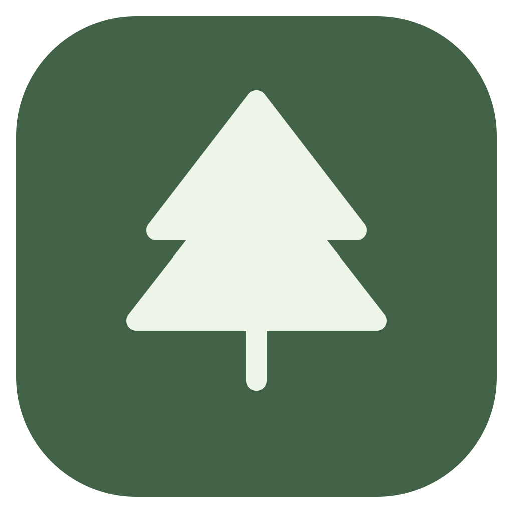
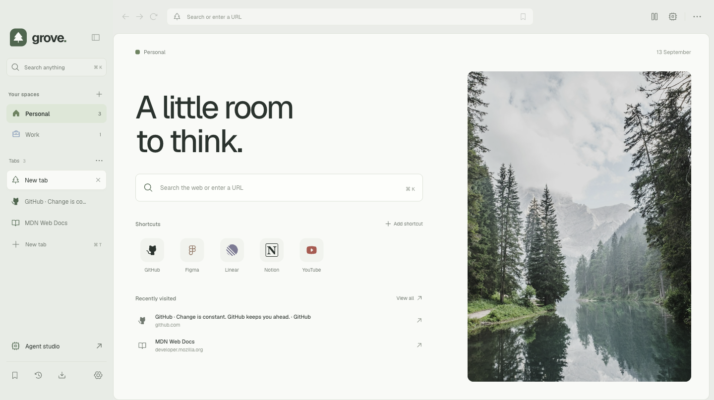
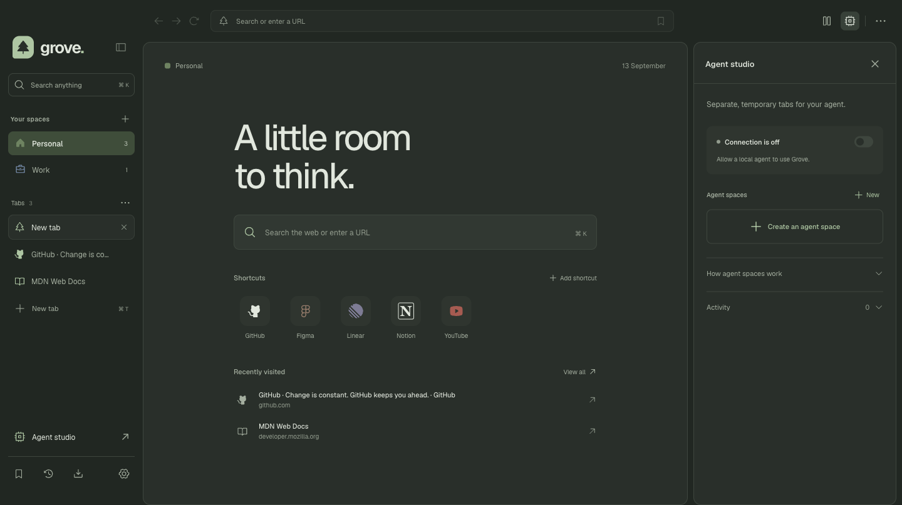
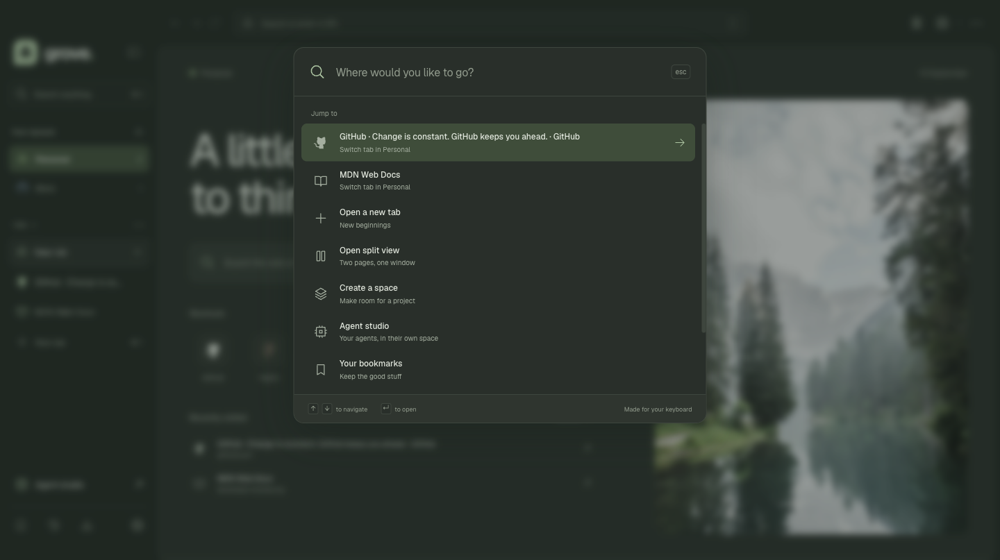

<p align="center">
  
</p>

<h1 align="center">Grove</h1>

<p align="center"><strong>A little more room to think.</strong></p>
<p align="center">An open source desktop browser with thoughtful spaces for you and your agents.</p>
<p align="center">macOS · Windows · Linux<br />Electron 44 · React 19 · TypeScript · MIT</p>

<picture>
  <source media="(prefers-color-scheme: dark)" srcset="docs/images/grove-dark.png" />
  
</picture>

<details>
  <summary>Agent studio and keyboard commands</summary>




</details>

Grove brings everyday browsing and agent automation into one visible workspace. Keep personal and work sessions separate, compare pages side by side, and give an agent its own temporary space. Take control whenever you need to.

This is a working Electron browser and a portfolio project. Websites run in Chromium through native `WebContentsView` instances. Grove is independently implemented, inspired by the idea of agent aware browsing, and is not affiliated with ego-browser.

## Made for a calmer workflow

| Feature               | What it does                                                                                                           |
| --------------------- | ---------------------------------------------------------------------------------------------------------------------- |
| Spaces                | Separate cookies and storage for each workspace. Personal spaces persist between launches. Agent spaces are temporary. |
| Vertical tabs         | Keep page titles readable, pin useful tabs, duplicate pages, and reopen a closed tab.                                  |
| Split view            | Read and compare two pages inside one browser window.                                                                  |
| Command palette       | Jump to a tab, open a page, or run a browser action from the keyboard.                                                 |
| Everyday browsing     | Address bar search, bookmarks, history, downloads, find in page, zoom, and page screenshots.                           |
| Agent handoff         | An optional local API, isolated task spaces, visible activity, and explicit human takeover.                            |
| Considered appearance | Light, dark, and system themes with a quiet forest new tab page.                                                       |

Agent support is a control interface for an external agent. Grove does not bundle an AI model or require an AI subscription. The [automation guide](docs/automation.md) includes connection instructions and examples.

The included [Grove skill](skills/grove-browser/SKILL.md) provides compact snapshots, stable element refs, trusted clicks and keys, scoped waits, and sequential action batches. In a reproducible four-page local comparison, its full snapshot output used **49.1% fewer tokens** than ego-browser 0.4.7.3. This measures observation text, not total model usage or universal browser compatibility. Read the [benchmark methodology and captured results](docs/benchmarks.md) and [local review report](docs/review.md).

## Use the Grove skill

Install the self-contained skill for Codex:

```sh
npm run skill:install
```

Start a new Codex session to discover `$grove-browser`. The installer works on macOS, Windows, and Linux, preserves an existing installation as a backup, and honors `CODEX_HOME`. Other agents can use the same bundled Node.js client directly.

Run Grove, enable the connection in **Agent studio**, and copy its connection details into a protected file outside your repository. Set `GROVE_CONNECTION_FILE` to that file. See [connection setup](skills/grove-browser/references/connection.md) for file permissions and Windows guidance. Then invoke the skill to open websites and work in a separate agent space. Agent spaces have their own logins and cookies.

## Run it locally

Use Node.js 22.12 or newer and npm. From this repository:

```sh
npm ci
npm run dev
```

To run a compiled desktop build:

```sh
npm run build
npm start
```

For interface development in an ordinary browser:

```sh
npm run dev:web
```

The web preview supports interactive browser controls using local state. Remote websites and the native automation server are available in the Electron app. The preview does not embed external sites.

## Optional portfolio preview

The [web preview workflow](.github/workflows/preview.yml) can publish the interactive interface to GitHub Pages when you choose to run it. It never deploys automatically on a push or pull request.

1. Add this project to your GitHub repository.
2. In the repository's **Settings > Pages**, choose **GitHub Actions** as the build and deployment source.
3. Open **Actions > Publish web preview > Run workflow** and run it from the default branch.
4. Open the published address shown in the workflow's deployment environment.

The workflow builds `dist/` with `npm run build:web` and uploads it as a Pages artifact. Relative asset paths support repository subpaths without a hardcoded username or repository name. This publishes only the interface preview; the desktop download remains the way to browse remote pages. GitHub documents the setup in [Using custom workflows with GitHub Pages](https://docs.github.com/en/pages/getting-started-with-github-pages/using-custom-workflows-with-github-pages).

## Build desktop packages

Run the matching command on its native operating system. Installers are written to `release/`.

| Platform | Command                 | Artifacts                                    |
| -------- | ----------------------- | -------------------------------------------- |
| macOS    | `npm run package:mac`   | DMG and ZIP for the current CPU architecture |
| Windows  | `npm run package:win`   | NSIS installer and portable EXE              |
| Linux    | `npm run package:linux` | AppImage and Debian package                  |

The [desktop workflow](.github/workflows/build.yml) runs validation, real Electron smoke tests, skill-driven form tests, and packaging on Apple Silicon macOS, Intel macOS, Windows x64, and Linux x64. It runs on pull requests, pushes to `main` or `master`, and manual dispatch. Download packages from a completed workflow's artifacts. The workflow does not publish releases. See [testing on your devices](docs/device-testing.md) for Windows and Linux steps.

The project homepage is declared in `package.json` for desktop packaging. Forks can update it to their own repository. See [packaging notes](docs/architecture.md#native-packaging) for details.

Packages are unsigned development builds. macOS signing and notarization and Windows code signing are not configured. Automatic updates are not implemented.

## Development

```sh
npm run check
npm run build
npm run test:desktop
npm run test:skill
node scripts/benchmark.mjs
```

On a Linux machine without a desktop session, prefix each desktop or skill test command with `xvfb-run -a`. The tests use local fixture servers and do not depend on third party websites. Set `GROVE_TEST_PUBLIC=1` to add read-only checks of Example.com, MDN, and Wikipedia to the skill test.

`npm run check` validates TypeScript, runs behavior tests, and checks authored files for prohibited dash punctuation. See [contributing](CONTRIBUTING.md) for the development workflow and [architecture](docs/architecture.md) for the process and session design.

## Project scope

Grove focuses on a complete browsing and agent handoff loop. It is an Electron application, not a Chromium fork. Chrome extension compatibility, password management, account sync, DRM support, an ad blocker, and a built in AI assistant are outside the current implementation. It has not received an independent security audit. See the [security model](docs/SECURITY.md) for isolation boundaries and local data handling.

Code is licensed under [MIT](LICENSE). The forest photograph is by [Luca Bravo on Unsplash](https://unsplash.com/photos/body-of-water-surrounded-by-pine-trees-during-daytime-ESkw2ayO2As), under the [Unsplash license](https://unsplash.com/license). Type uses [Geist](https://github.com/vercel/geist-font), and icons use [Phosphor](https://github.com/phosphor-icons/react). Their respective licenses apply to those assets.
