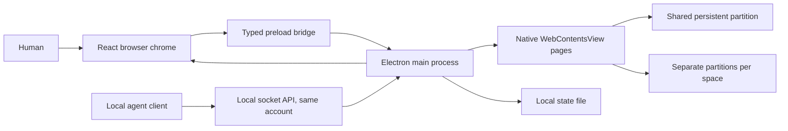

# Architecture

Kamapathy separates browser chrome, remote web pages, and native capabilities. Its UI is React and TypeScript. Electron provides Chromium rendering, operating system windows, session storage, and downloads.

## Process boundary

The shell renderer owns layout, keyboard interactions, panels, and the command palette. It receives browser state and dispatches typed actions through `KamapathyBridge`. The preload exposes that interface instead of arbitrary IPC or Node.js primitives.

The main process owns the authoritative native state and tab lifecycle. Each remote tab is a separate `WebContentsView`. Remote pages use sandboxing, context isolation, and disabled Node integration. They do not receive the browser shell preload. See [Electron's WebContentsView documentation](https://www.electronjs.org/docs/latest/api/web-contents-view) for the rendering primitive.

The renderer reports the rectangle reserved for web content. The main process positions the active native view in that rectangle, or positions two views for split view. Native views draw above the shell, so before a popover, grid or dialog covers the page the renderer asks the main process for still captures of the visible views, draws them in their place, and only then asks it to hide the views. Closing shows the views again before the captures are removed, so the page area is never blank. If a capture fails or takes longer than 300 ms, the page area is shown empty instead.

## State and sessions

`shared/types.ts` defines the browser state, spaces, tabs, settings, actions, and bridge contract. `shared/url.ts` normalizes addresses and search text while rejecting unsupported schemes and URL credentials. Native navigation also validates destinations.

Spaces share one persistent Electron session partition by default, `persist:space-personal`, so cookies and sign-ins made in any shared space are available in every other shared space and survive restart. Each space records its choice in `signIns`. A personal space with separate sign-ins uses `persist:space-<id>`, persistent and its own. An agent space with separate sign-ins uses a temporary in-memory partition, `agent-<run>-<id>`, that disappears when Kamapathy quits; an agent space is separate when the Isolate agent spaces setting is on or when the API asked for an isolated space. Session handlers for permissions and downloads are attached once per partition and resolve the space from the page that asked, so agent spaces deny both on the shared session too, and permission grants are keyed by space, origin, and permission. A personal space can switch between shared and separate later; its tabs reload in the new partition, and a separate partition it leaves behind is cleared. Deleting a space clears only a partition that space alone used. Agent spaces are excluded from session restoration. This is session separation inside one desktop application, not operating system user isolation.

The application persists personal spaces and tabs, bookmarks, personal browsing history, and settings in `browser-state.json` in its Electron user data directory. `KAMAPATHY_USER_DATA` can override that directory for testing. Writes use a temporary file and rename. Restored state is validated before use. Downloads and the live activity feed are runtime state. Agent visits are excluded from the saved history. Bookmarks and history imported from another browser go through `electron/import.ts`, a Node module that reads Chromium, Firefox, and Safari files, and merge into the same state deduplicated by URL and capped at 1000 each; `shared/topsites.ts` ranks that history for the welcome dialog. Chromium maintains page storage separately from the JSON application state. See [Electron's session documentation](https://www.electronjs.org/docs/latest/api/session) for partition behavior.

Agent spaces start on the shared session unless isolated, so an agent can use the sites the person has signed in to, in a space the person can see. API operations are restricted to spaces created through the current server instance or explicitly granted by the user in Kamapathy. Ownership controls whether the automation API may operate a space. Taking control changes ownership to the human and prevents subsequent agent reads and actions on that space until the human returns control or the agent takes it back through the API's resume route. Turning agent access off stops all automation. The [automation reference](automation.md) documents the API boundary in detail.

## Web preview

The web preview implements `KamapathyBridge` with local state. This lets the same interface run in Vite without Electron. It supports inspecting and exercising the browser chrome, including workspace and tab interactions.

The preview cannot instantiate Electron views, access native downloads, or host the automation server. Opening a remote address in the preview displays the intended destination and an explanation that native browsing requires the desktop app. It is not a proxy browser or an iframe based browser.

## Native packaging

`electron-builder.yml` packages compiled files from `out/`. Branding assets are supplied as PNG, ICNS, and ICO files. Platform targets are DMG and ZIP for macOS, NSIS and portable EXE for Windows, and AppImage and DEB for Linux. Configuration uses the [electron-builder v26 schema](https://www.electron.build/v26/docs/configuration/).

The GitHub workflow uses four native runners: macOS ARM64, macOS x64, Windows x64, and Linux x64. It installs locked dependencies, validates the project, builds the app, runs the native smoke test, packages artifacts, and uploads them. Other architectures are not part of this validation matrix. Runner labels are selected from [GitHub's hosted runner reference](https://docs.github.com/en/actions/reference/runners/github-hosted-runners).

The Debian packager needs project homepage metadata and a maintainer. The config declares Kamapathy contributors as maintainer, and `package.json` declares the repository homepage. Update that field when packaging a fork. Keeping the value in package metadata also avoids shell-specific parsing of dotted command-line overrides.

Signing and publishing are disabled in the development configuration. macOS also disables hardened runtime for these unsigned development bundles. Before a production release, configure a valid signing identity, enable hardened runtime with appropriate entitlements, add notarization, and validate the resulting artifact. See the [macOS signing settings](https://www.electron.build/v26/docs/mac/). Windows signing and a maintained update mechanism are also future release work.

## Project map

| Path                 | Responsibility                                                           |
| -------------------- | ------------------------------------------------------------------------ |
| `src/`               | Shared browser UI, dialogs, command palette, styling, web preview bridge |
| `shared/`            | Data contracts, initial state, address handling                          |
| `shared/topsites.ts` | Ranks history and bookmarks into the welcome dialog's top sites          |
| `electron/`          | Native browser, preload, persistence, automation server                  |
| `electron/import.ts` | Reads bookmarks and history from other browsers, without Electron        |
| `scripts/`           | Native smoke test, copy validation, development helpers                  |
| `tests/`             | Behavior and boundary tests                                              |
| `build/`             | Native application icons                                                 |
| `.github/workflows/` | Native verification and downloadable build artifacts                     |
| `docs/`              | Architecture, automation, security model, screenshots                    |

## Current tradeoffs

Electron makes one maintainable browser implementation possible across three desktop platforms, with the distribution size of an embedded Chromium runtime. Kamapathy does not claim lower memory use or faster browsing than established browsers.

This version focuses on one browser window and a coherent human and agent workflow. It has no extension marketplace, sync service, password vault, built in model, or automatic updater. The visible interface and security boundaries are intended to be inspectable and testable, while a full production browser security review remains future work.
