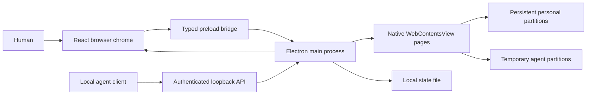

# Architecture

Grove separates browser chrome, remote web pages, and native capabilities. Its UI is React and TypeScript. Electron provides Chromium rendering, operating system windows, session storage, and downloads.

## Process boundary

The shell renderer owns layout, keyboard interactions, panels, and the command palette. It receives browser state and dispatches typed actions through `GroveBridge`. The preload exposes that interface instead of arbitrary IPC or Node.js primitives.

The main process owns the authoritative native state and tab lifecycle. Each remote tab is a separate `WebContentsView`. Remote pages use sandboxing, context isolation, and disabled Node integration. They do not receive the browser shell preload. See [Electron's WebContentsView documentation](https://www.electronjs.org/docs/latest/api/web-contents-view) for the rendering primitive.

The renderer reports the rectangle reserved for web content. The main process positions the active native view in that rectangle, or positions two views for split view. When a shell overlay needs the same area, native views are hidden so they do not obscure the overlay.

## State and sessions

`shared/types.ts` defines the browser state, spaces, tabs, settings, actions, and bridge contract. `shared/url.ts` normalizes addresses and search text while rejecting unsupported schemes and URL credentials. Native navigation also validates destinations.

Each personal space has a persistent Electron session partition. Its cookies and origin storage remain separate from other spaces and survive restart. Agent spaces use temporary partitions and are excluded from session restoration. This is session separation inside one desktop application, not operating system user isolation.

The application persists personal spaces and tabs, bookmarks, personal browsing history, and settings in `browser-state.json` in its Electron user data directory. `GROVE_USER_DATA` can override that directory for testing. Writes use a temporary file and rename. Restored state is validated before use. Downloads and the live activity feed are runtime state. Agent visits are excluded from the saved history. Chromium maintains page storage separately from the JSON application state. See [Electron's session documentation](https://www.electronjs.org/docs/latest/api/session) for partition behavior.

Agent spaces start with a fresh session. They do not inherit the user's existing cookies or another browser's sign ins. API operations are restricted to spaces created through the current server instance or explicitly granted by the user in Grove. Ownership controls whether the automation API may operate a space. Taking control changes ownership to the human and prevents subsequent agent reads and actions on that space until the human resumes automation. The [automation reference](automation.md) documents the API boundary in detail.

## Web preview

The web preview implements `GroveBridge` with local state. This lets the same interface run in Vite without Electron. It supports inspecting and exercising the browser chrome, including workspace and tab interactions.

The preview cannot instantiate Electron views, access native downloads, or host the automation server. Opening a remote address in the preview displays the intended destination and an explanation that native browsing requires the desktop app. It is not a proxy browser or an iframe based browser.

## Native packaging

`electron-builder.yml` packages compiled files from `out/`. Branding assets are supplied as PNG, ICNS, and ICO files. Platform targets are DMG and ZIP for macOS, NSIS and portable EXE for Windows, and AppImage and DEB for Linux. Configuration uses the [electron-builder v26 schema](https://www.electron.build/v26/docs/configuration/).

The GitHub workflow uses four native runners: macOS ARM64, macOS x64, Windows x64, and Linux x64. It installs locked dependencies, validates the project, builds the app, runs the native smoke test, packages artifacts, and uploads them. Other architectures are not part of this validation matrix. Runner labels are selected from [GitHub's hosted runner reference](https://docs.github.com/en/actions/reference/runners/github-hosted-runners).

The Debian packager needs project homepage metadata and a maintainer. The config declares Grove contributors as maintainer. CI supplies the actual GitHub repository URL as `extraMetadata.homepage`. Local packaging can infer the homepage from a GitHub git remote. If the project has a different homepage, pass electron-builder's `-c.extraMetadata.homepage` option with that real URL. This requirement comes from [the Debian target metadata checks](https://github.com/electron-userland/electron-builder/blob/v26.0.12/packages/app-builder-lib/src/targets/FpmTarget.ts).

Signing and publishing are disabled in the development configuration. macOS also disables hardened runtime for these unsigned development bundles. Before public distribution, configure a valid signing identity, enable hardened runtime with appropriate entitlements, add notarization, and validate the resulting artifact. See the [macOS signing settings](https://www.electron.build/v26/docs/mac/). Windows signing and a maintained update mechanism are also future release work.

## Project map

| Path                 | Responsibility                                                           |
| -------------------- | ------------------------------------------------------------------------ |
| `src/`               | Shared browser UI, dialogs, command palette, styling, web preview bridge |
| `shared/`            | Data contracts, initial state, address handling                          |
| `electron/`          | Native browser, preload, persistence, automation server                  |
| `scripts/`           | Native smoke test, copy validation, development helpers                  |
| `tests/`             | Behavior and boundary tests                                              |
| `build/`             | Native application icons                                                 |
| `.github/workflows/` | Native verification and downloadable build artifacts                     |
| `docs/`              | Architecture, automation, security model, screenshots                    |

## Current tradeoffs

Electron makes one maintainable browser implementation possible across three desktop platforms, with the distribution size of an embedded Chromium runtime. Grove does not claim lower memory use or faster browsing than established browsers.

This version focuses on one browser window and a coherent human and agent workflow. It has no extension marketplace, sync service, password vault, built in model, or automatic updater. The visible interface and security boundaries are intended to be inspectable and testable, while a full production browser security review remains future work.
